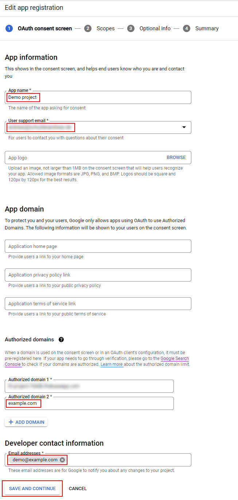
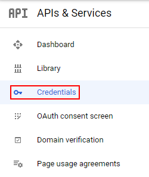
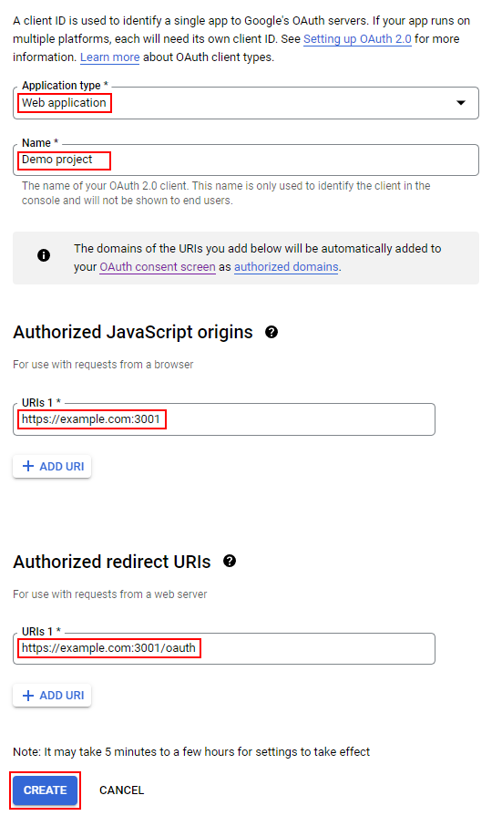

# Integrating Google Sign-In

If you followed the setup instructions, your project was created using username/password based authentication. You can
switch to authentication using Google Sign-In if you want. This makes relinking your project in the app a little easier
as you don't have to enter your username and password again. For regular users it is not necessary though.

1.  Navigate to the [GCP oAuth consent screen configuration](https://console.cloud.google.com/apis/credentials/consent).

2.  Check that your project is selected in the header bar.\
    <kbd></kbd>

3.  If you haven't configured the OAuth consent screen yet, you will be asked for the user type. Choose "External" and
    click "Create".\
    <kbd></kbd>

4.  In case you already had your consent screen configured earlier, there's a link "Edit App" next to the title which
    will open the configuration form again.\
    <kbd></kbd>

5.  Enter a name for your project, select your e-mail address from the list and at the bottom of the form enter your
    e-mail again as developer contact. Add your domain "example.com" (without protocol and port) as authorized domain.
    Then click "Save and continue".\
    <kbd></kbd>

5.  In the next two steps "Scopes" and "Optional info" leave all fields empty and click "Save and continue".

6.  On the last step you'll see a summary of your settings. Check that it looks like in the screenshot. Especially check
    that your domain is added as authorized domain.\
    <kbd></kbd>

7.  Select "Credentials" on the left sidebar.\
    <kbd></kbd>

8.  Click "Create credentials" and choose OAuth client ID.
    <kbd></kbd>

9.  Choose "Web application" as application type. Enter a name for your project. As "Authorized JavaScript Origin" enter
    the URL of your service without a path (https://example.com:3001). As "Authorized redirect URI" add the URL of your
    service with the path "/oauth" (https://example.com:3001/oauth). Then click "Create".\
    <kbd></kbd>

10. Copy the client ID. You will need it later.\
    <kbd></kbd>

11. When you come back to this step later and need the client ID again, you can copy it from the table "OAuth 2.0 Client
    IDs". Check that you are copying from the correct row.\
    <kbd></kbd>

11. Open the configuration of the Google management node in Node-RED. Check "Use Google login" and enter the client ID
    you copied earlier. Add your email address (the one your Google account is registered to) as authorized email. Save
    and deploy your flows.\
    <kbd></kbd>

12. Re-link your account as described in the section [Setup Account Linking](setup_instructions.md#setup_account_linking). In the Google Home app Click on your linked services and select "reconnect account". Here you will see a screen that asks if you want to link your account, click on "Continue". Instead of username and password you will have the button "Sign in with Google".\
   <kbd></kbd>
\
    <kbd></kbd>
