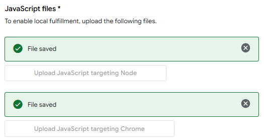

# Local fulfillment

Local fulfillment establishes direct communication between your smart speaker and Node-RED. This reduces latencies
and makes your devices respond faster. It is not required though. If local fulfillment is not setup or is not available,
Google will fall back to the "normal" mode.

This tutorial assumes your service is already set up and working.

---

## Enable Local Fulfillment

1. Open the [Actions on Google Console](https://console.actions.google.com/) and select your project.\
   <kbd></kbd>

2. Click `Develop` on the top of the page, then click `Actions` located in the hamburger menu on the top left.\
   <kbd></kbd>

3. Click the button `Upload JavaScript files`.\
   <kbd></kbd>

4. Upload [this Javascript file](https://raw.githubusercontent.com/mikejac/node-red-contrib-google-smarthome/master/local-execution/app.js)
   for both Node and Chrome.\
   <kbd></kbd>

5. Tick the `Support local query` checkbox.\
   <kbd></kbd>

6. Add device scan configuration:
    1. Click `+ New scan config`
    2. Select `MDNS`
    3. set mDNS service name to `_nodered-google._tcp.local`

7. The complete local fulfillment form should look like this.\
   <kbd></kbd>

8. `Save` your changes.

9. Restart your smart speaker and Node-RED.

10. Now control your device. If local fulfillment is working, you will see a ring icon instead of the usual filled
    circle.\
    <kbd></kbd>
    

Local fulfillment can be tricky to set up. If you have problems, look at the troubleshooting section in the readme.
