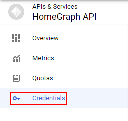
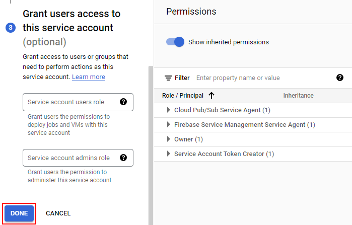
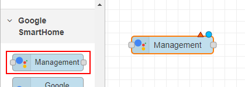
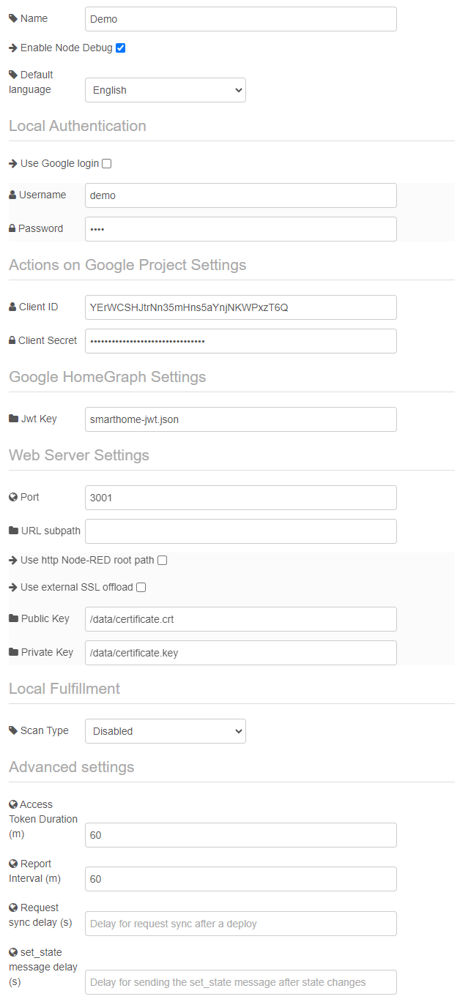
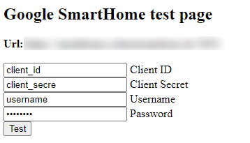
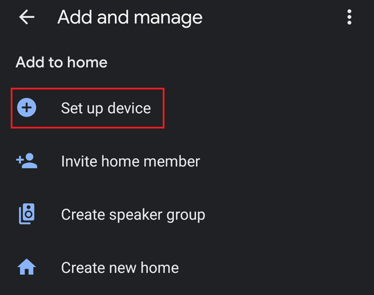
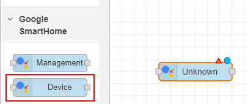
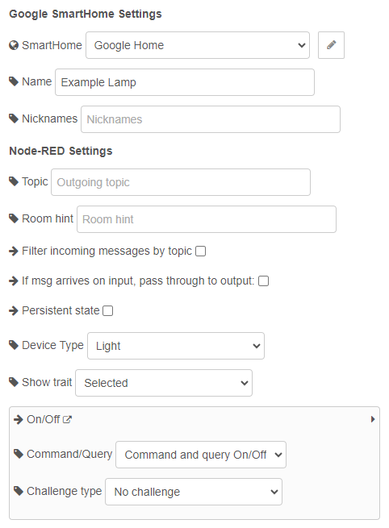
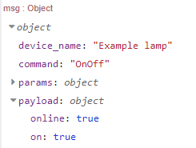
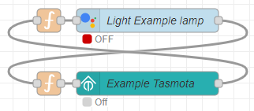

# Setup Instructions

## Prerequisites

- You need to be able to forward incoming traffic from the internet to a specific port on your host. This may be
  difficult if your ISP uses carrier-grade NAT, if you are on a shared network (e.g. in dormitories) or if you can'tconfigure port forwarding
  on your router. In this case you can use services like [ZeroTier](https://www.zerotier.com/) or
  [Cloudflare Tunnel](https://www.cloudflare.com/products/tunnel/).
- This package requires at least NodeJS 10.0.0.

---

## Register a domain

You need your own domain. This can be a paid domain or a free subdomain from a DynDNS provider. The A record of your
domain must point to your public IP address.

If your IP address changes regularly, make sure your domain's DNS record is updated on each change. This usually means
installing an update client for your domain. Some routers also support DynDNS updates. Most DynDNS providers have
instructions on how to do this.

This tutorial assumes that your domain is `example.com`. Replace the domain accordingly.


## Get an SSL certificate

Google requires an SSL encrypted connection to your server. This requires a valid SSL certificate. Self-signed
certificates won't work.

You can use a free certificate from Let's Encrypt or ZeroSSL. For this, you can either use a certificate client
(see [this guide for acme.sh](ssl_certificate.md)) or you can use a reverse proxy with built-in certificate management
(see [this guide on how to use Caddy](reverse_proxies.md])).


## Create project in Actions Console

First we will register a new Smart Home project in the Actions Console.

1.  Go to [Actions on Google Console](https://console.actions.google.com).


2.  Click on *New project*.\
    <kbd></kbd>


3.  Enter a name and select the language and country for your project. Then click *Create Project*.\
    <kbd></kbd>


4.  Select the type *Smart Home*, then click *Start Building*.\
    <kbd></kbd>


5.  Make sure your project is selected in the header bar.\
    <kbd></kbd>


6.  Switch to the *Develop* tab and select *Invocation* from the sidebar.\
    <kbd></kbd>


7.  Enter a name for your project. Click *Save*.\
    <kbd></kbd>


8.  While still on the *Develop* tab, select *Actions* from the sidebar.\
    <kbd></kbd>


9.  Enter the fulfillment URL. This is the URL of your service, followed by "/smarthome", for example
    https://example.com:3001/smarthome. Set the log level to "All". Leave all other fields blank. Then click *Save*.\
    <kbd></kbd>


10. While still on the *Develop* tab, select *Account linking* from the sidebar.\
    <kbd></kbd>


11. Fill in the fields as follows:
    * Client ID and secret: Credentials that Google will use to authenticate against your service. Use a password
      generator such as https://passwordsgenerator.net/ to generate two strings of reasonable length (e.g. 32 chars).
      It's recommended not to use special characters as they can cause problems. Copy both strings, you'll need them later.
    * Authorization URL: This is the URL of your service, followed by '/oauth', for example https://example.com:3001/oauth.
    * Token URL: This is the URL of your service, followed by '/token', e.g. https://example.com:3001/token.
    * Leave all other fields at their default values.\
   <kbd></kbd>


12. Click *Save*.\
    <kbd></kbd>


12. Switch to the *Deploy* tab and select *Directory Information* from the sidebar.\
    <kbd></kbd>


13. Fill in the form. It doesn't matter what you enter, these information will not be shown anywhere, but Google
    requires this form to be filled out. As small logo I used https://nodered.org/about/resources/media/node-red-icon.png,
    as large image I used an image from https://placekitten.com/1920/1080. The full form looks similar to this:\
    <kbd></kbd>


12. Click *Save*.\
    <kbd></kbd>


13. While still on the *Deploy* tab, select *Company details*.
    <kbd></kbd>


14. Same as before, fill in the form as you want.
    <kbd></kbd>


15. Click *Save*.
    <kbd></kbd>


16. You don't need to fill in anything on the other tabs.


**Note:** You can't test your project in the Action Console's simulator. It only works on real devices.


## Enable HomeGraph API

Next we will enable the HomeGraph API and download the credentials. This API is used to report the state of your devices
to Google and to notify Google about new or updated devices.

1.  Go to the [Google HomeGraph API page](https://console.cloud.google.com/apis/library/homegraph.googleapis.com).


2.  Make sure your project is selected in the header bar.\
    <kbd></kbd>


3.  If you had to switch projects and were redirected away from the HomeGraph API page, open the
    [Google HomeGraph API page](https://console.cloud.google.com/apis/library/homegraph.googleapis.com) again.


4.  Click *Enable*.\
    <kbd></kbd>


5.  Select *Credentials* from the left sidebar (or go to the
    [API credentials page](https://console.cloud.google.com/apis/api/homegraph.googleapis.com/credentials)).\
    <kbd></kbd>
    

6.  Click *Create Credentials* and select *Service account*.\
    <kbd></kbd>


7.  Enter a name for your service account. A service account ID should be generated automatically.\
    <kbd></kbd>


8.  Leave steps 2 and 3 empty, just skip them with *Continue* and *Done* buttons.\
    <kbd></kbd>
    <kbd></kbd>


9.  Find your newly created service account in the list and click the Edit button.\
    <kbd></kbd>


10. Switch to the tab *Key*.\
    <kbd></kbd>


11. Click on *Add Key*, then *Create Key*.\
    <kbd></kbd>


12. Choose type *JSON* and click *Create*.\
    <kbd></kbd>


13. A JSON file containing the JWT key will be downloaded to your computer. Copy it to your Node-RED server, in a
    location where the Node-RED service can read it.


## Install and configure Node-RED module

Now we will install and configure the module in Node-RED.

1. Install `node-red-contrib-google-smarthome` from the Node-RED palette and restart Node-RED.\
   <kbd></kbd>


2. Place the Management node from the section "Google Smart Home" on a flow.\
    <kbd></kbd>


3. Edit the management node and open its config. Fill in the fields as follows:
    * Name: A name for your config node.
    * Enable Node Debug: Check this box if you want to see debug messages from the node. Enable it for now.
    * Default Language: The language of your project.
    * Use Google login: Check this box if you want to use Google Sign-In authentication. This tutorial uses the simpler
      password based authentication, so uncheck this box.
    * Username/Password: Username and password of your choice. You will use this to log in in the Google Home App later.
    * Client ID and Client Secret: The client ID and secret you previously entered in the Google Actions Console.
    * Jwt Key: Path to the JSON file you downloaded when you enabled the HomeGraph API. Can be an absolute path or a
      path relative to Node-RED's user dir (where your settings.js, flows.json etc. are stored).
    * Port: The port on which to run the service. If left empty, the service will run on the same port as Node-RED.
      This port must be reachable from the internet (but be careful to protect your Node-RED from external access if
      you expose this port to the internet).\
      This tutorial assumes port 3001, so set it to 3001.
    * URL subpath: URL subpath to add to the URL. If set, the URL will change from `https://example.com:3001/check` to
      `https://example.com:3001/<subpath>/check` (resp. `/<subpath>/smarthome`, `/<subpath>/oauth`, `/<subpath>/token`).
      This tutorial doesn't use subpaths, so leave it empty.
    * Use http Node-RED root path: If enabled, the service will respect the setting "httpNodeRoot" in Node-RED's
      settings.js. If set, the service will use https://example.com:3001/<httpNodeRoot>/smarthome. If there is also a
      path set in the Path field, the service will use https://example.com:3001/<httpNodeRoot>/<yourpath>/smarthome.
      This tutorial assumes a simple path setup, so leave it empty.
    * Use external SSL offload: If enabled, the smarthome service will use HTTP instead of HTTPS. This allows you to use
      a reverse proxy such as Caddy or Nginx Proxy Manager to manage SSL certificates. Also see our
      [guide on reverse proxies](docs/reverse_proxies.md).
    * Public key: Path to the SSL certificate file, e.g. `fullchain.pem` from Let's Encrypt.
    * Private Key: Path to private SSL key file, e.g. `privkey.pem` from Let's Encrypt.
        * Don't set if you use SSL offloading.
        * Paths can be absolute or relative to Node-RED's user dir.
        * Certificates are automatically reloaded after renewal. You don't need to restart Node-RED.
    * Scan Type: Specifies how your smart speaker will search for Node-RED instances on your local network to use for
      local fulfillment. You can set up local fulfillment later, so set it to "Disabled" for now.
    * Access Token Duration, Report Interval, Request sync delay, set_state message delay: Usually you don't need to
      change these values. Leave them at their default values.\
    <kbd></kbd>
    

4. Deploy the flow.\
   <kbd></kbd>


5. Verify that your service is reachable. Open https://example.com:3001/check in your browser. You should see the
   "Google SmartHome test page". You don't have to enter anything here, if you see the page, you're good to go.\
   <kbd></kbd>


6. Also check that the page is reachable from the internet. Use a tool such as https://reqbin.com to send a GET request
   to https://example.com:3001/check (using your domain name and port). It should respond with status 200 and the
   message "SUCCESS: Smart Home service is reachable!".\
   <kbd></kbd>


## Setup Account linking

Finally, we will link the Google Home App to the Node-RED service.

1. Open the Google Home App on a device that is logged in to the same Google account that you used to create the project
   in the Actions Console.


2. Click the '+' sign to add a device.\
   <kbd></kbd>
   

3. Click *Set up device*.\
   <kbd></kbd>


4. Click *Have something already set up*.\
   <kbd></kbd>


5. Select your service from the list of all providers. Your service will be prefixed with `[test]`.
   <kbd></kbd>


6. Log in to your service. The username and password are the ones you specified in the configuration node.\
   <kbd></kbd>


8. Say "Hey Google, sync my devices". Google should respond that your project has been successfully synced.


9. Congratulations! Your project has been successfully set up. You are now ready to add devices.


## Basic usage

1. Place the device node from the "Google Smart Home" section on a flow.\
   <kbd></kbd>


2. Open the configuration of your device. Give it a name and select a device type. Here you also configure the traits of
   your device. Traits define the functionalities of your device. Some traits are required by the device type, but you
   can freely add more traits. A list of all traits and detailed descriptions is available on
   https://developers.home.google.com/cloud-to-cloud/traits?hl=en.
   For the beginning, configure your device as a lamp with the On/Off trait.\
   <kbd></kbd>


3. Connect a debug node to its output side to see what happens when you control the device.
   <kbd></kbd>


4. Deploy your flow.


5. Say "Hey Google, turn on the light" or turn on the light in the app.


6. You'll see the output message in the debug panel. The most interesting part is the `payload`. This contains the new
   state of your device. The `on` parameter will now be `true`.\
   <kbd></kbd>


7. To connect the Google device node to your actual device, you usually need to convert the payload to what your device
   expects. You could use a `change` or `function` node to do this.
   Let's say I have a Tasmota device (using node-red-contrib-tasmota). Tasmota expects `msg.payload` to be a single
   boolean value, but the Google device outputs `msg.payload` as an object. So I used a function node to do the
   conversion.\
   <kbd></kbd>\
   I hid the label of the function node on the "Appereance" tab to make it shorter. The function node uses this code:
   ```javascript
   return {
       payload: msg.payload.on
   };
   ```


8. If you just want to control your device, you are done now. If you want to get the current state of your device in the
   app or using Google Assistant ("Hey Google, is the light on?"), you need to send the current state of your device
   to the Google device. This usually means taking the output of your actual device, converting it using a
   `change` or `function` node and then passing it to the Google device.\

   You can inject values in one of two ways. You can either set the state name as `topic` and the value as `payload`:
   ```json
   {
       "topic": "on",
       "payload": true
   }
   ```
   
   Or you can send an object with the state name as key and the state value as value:

   ```json
   {
       "on": true
   }
   ```

   To get the state names (like `on`, `brightness` etc.) and their descriptions, you can have a look on the official
   trait list at https://developers.home.google.com/cloud-to-cloud/traits?hl=en. The states are listed under each trait
   in the section "Device States". Or you can control your device and use the state names you get from the output
   messages.

   A Tasmota lamp with fully connected inputs and outputs would look like this:\
   <kbd></kbd>
   
   The code for the (upper) function node is:
   ```javascript
   return {
       "payload": {
           "on": msg.payload
       }
   };
   ```

---

## Further information

- You can enable [local fulfillment](local_fulfillment.md) for faster response times.
- You can [switch to Google Sign-In](google_signin.md) to make logging in a bit easier.


## Troubleshooting

- If you encounter any problems, please refer to the [Troubleshooting section](README.md#troubleshooting) in the Readme.
- If you have questions, ask them on our [Discussions page](https://github.com/mikejac/node-red-contrib-google-smarthome/discussions).
- If you think you have found a bug, report it on our [Issue Tracker](https://github.com/mikejac/node-red-contrib-google-smarthome/issues).
