# Setup Instructions

## Prerequisites

- This tutorial assumes your service will be running on https://example.com:3001. Adjust domain, port and paths
  according to your settings.
- You need a 'real' SSL certificate e.g. from [Let’s Encrypt](https://letsencrypt.org/). Make sure you have the public
  and private key file. You can also use a reverse proxy (like Caddy or Traefik) for certificate management and
  SSL termination.
- TCP traffic on port 3001 needs to be forwarded from the Internet to your host where Node-RED is running.
- This package requires NodeJS version 12.0.0 at a minimum.

---

## Create project in Actions Console

First we will register a new Smart Home project in the Actions Console.

1.  Go to [Actions on Google Console](https://console.actions.google.com).

2.  Click on *New project*.\
    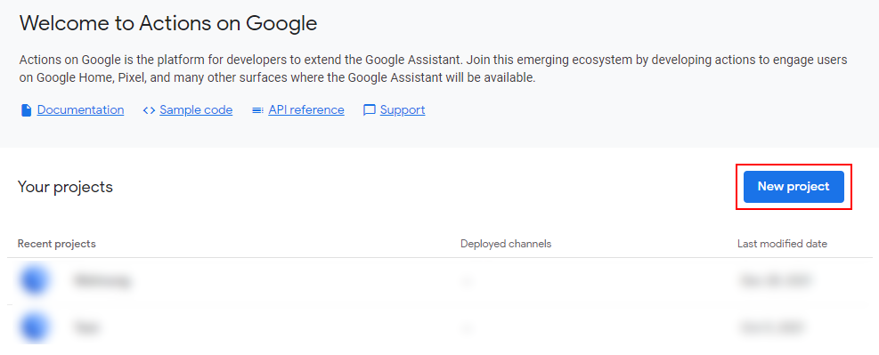

3.  Enter a name and select the language and country for your project. Then click *Create Project*.\
    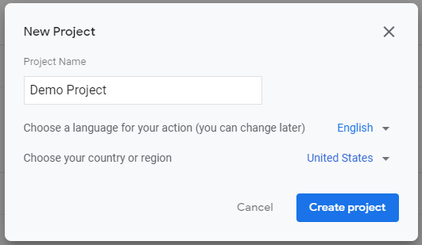

4.  Choose type *Smart Home*, then click *Start Building*.\
    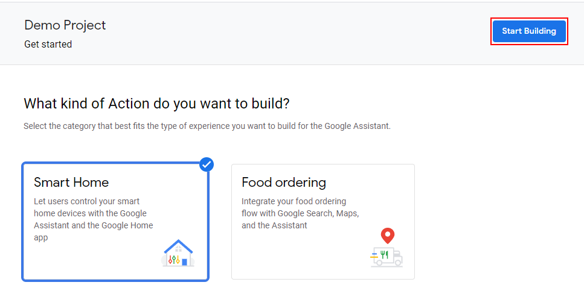

5.  Check that your project is selected in the header bar.\
    

6.  Leave the tab *Overview* empty. Switch to tab *Develop* and choose *Invocation* from the sidebar.\
    

7.  Enter your App's name. Click *Save*.\
    

8.  Still on tab *Develop* choose *Actions* from the sidebar.\
    

9.  Enter the fulfillment URL. This is the URL of your app, followed by "/smarthome", e.g.
    https://example.com:3001/smarthome. Set the log level to "All". Leave all other fields empty. Then click *Save*.\
    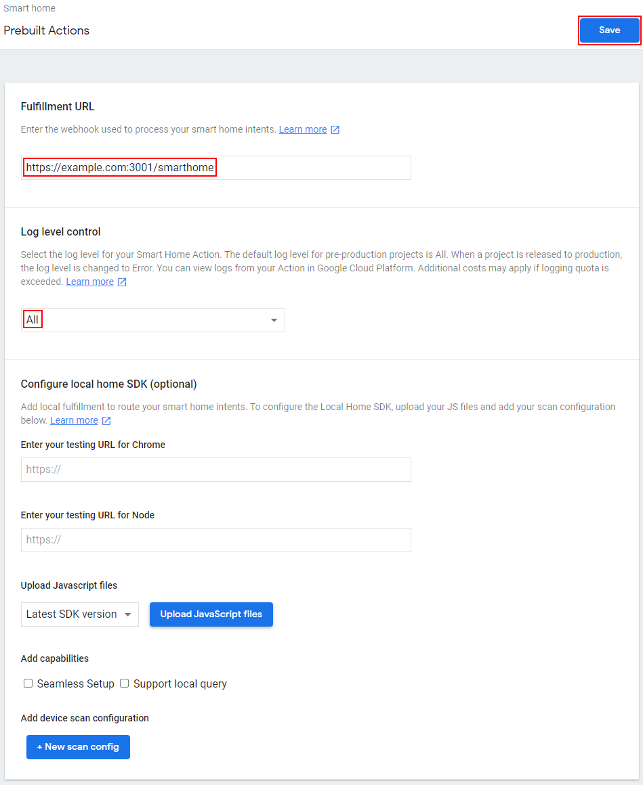

10. Still on tab *Develop* choose *Account linking* from the sidebar.\
    

11. Fill in the fields as follows:
     * Client ID and secret: Credentials, with which Google will authenticate against your app. Use a password generator
       like https://passwordsgenerator.net/ to generate two strings of reasonable length (e.g. 32 chars). It's
       recommended to not use special characters as they can lead to problems. Copy both strings, you'll need them later.
     * Authorization URL: This is the URL of your app, followed by '/oauth', e.g. https://example.com:3001/oauth.
     * Token URL: This is the URL of your app, followed by '/token', e.g. https://example.com:3001/token.
     * Leave all other fields at their default values.\
   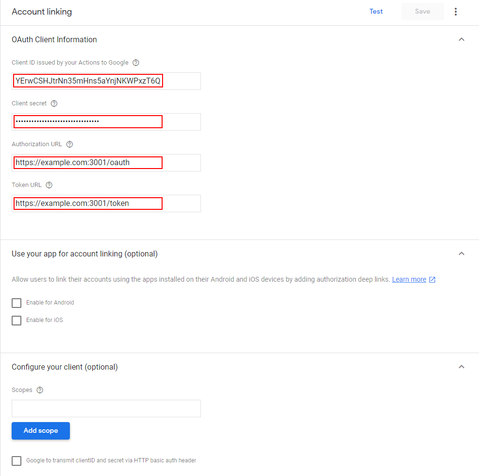

12. Click *Save*.\
    

13. You don't need to fill in anything on the other tabs.

**Note:** You can't test your project in the Action Console's simulator. It only works on real devices.

## Enable HomeGraph API

Next we will enable the HomeGraph API and download the credentials. This API is used to report the state of your devices
to Google and to inform Google about new or updated devices.

1.  Go to the [Google HomeGraph API page](https://console.cloud.google.com/apis/library/homegraph.googleapis.com).

2.  Check that your project is selected in the header bar.\
    

3.  In case you had to switch projects and were redirected away from the HomeGraph API page, open the
    [Google HomeGraph API page](https://console.cloud.google.com/apis/library/homegraph.googleapis.com) again.

4.  Click *Enable*.\
    

5.  From the left sidebar select *Credentials* (or open the
    [API credentials page](https://console.cloud.google.com/apis/api/homegraph.googleapis.com/credentials)). \
    
    

6.  Click *Create Credentials* and select *Service account*.\
    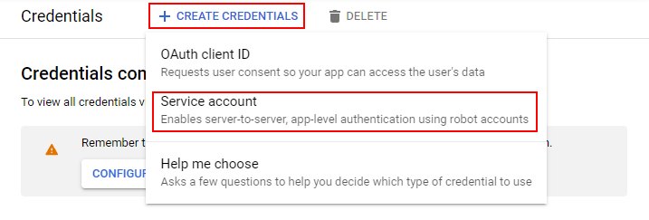

7.  Enter a name for your service account. A service account ID should be automatically generated.\
    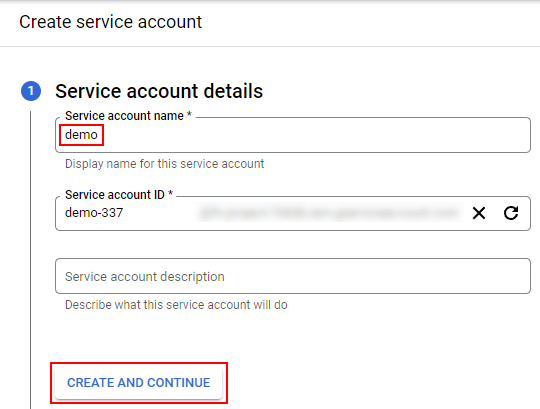

8.  Leave steps 2 and 3 empty, just skip them with *Continue* and *Done* buttons.\
    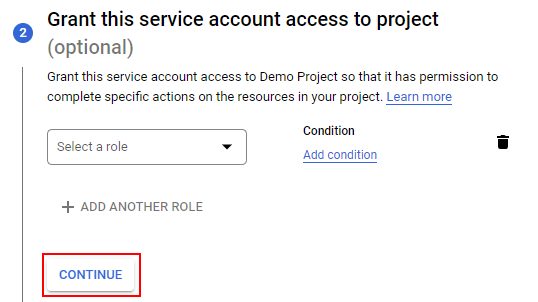
    

9.  Find your newly create service account in the list and click on the edit button.\
    

10. Switch to the tab *Key*.\
    

11. Click on *Add Key*, then *Create Key*.\
    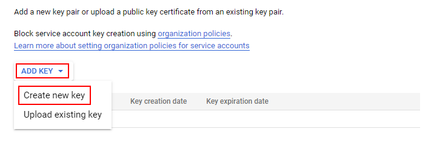

12. Choose type *JSON* and click *Create*.\
    

13. A JSON file containing the JWT key will be downloaded to your computer. Copy it to your Node-RED server, in a
    location where the Node-RED service can read it.

## Install and configure Node-RED module

Now we will install the module in Node-RED and configure it.

1. Install `node-red-contrib-google-smarthome` from Node-RED's palette and restart Node-RED.\
    

2. Place the Management node from the section "Google Smart Home" on a flow.\
    

3. Edit the management node and open its config. Fill in the fields as following:
    * Name: A name for your config node.
    * Enable Node Debug: Check this box if you want to see the debug messages from the node. Enable it for now.
    * Default Language: The language of your project.
    * Use Google login: Check, if you want to use authentication via Google Sign-In. This tutorial uses the simpler
      password based authentication, so disable it.
    * Username/Password: Username and password of your choice. You use this to log in with the Google Home App later.
    * Client ID and Client Secret: The client ID and secret you entered in the Google Actions Console earlier.
    * Jwt Key: Path to the JSON file you downloaded while enabling the HomeGraph API. Can be an absolute path or a path
      relative to Node-REDs user dir (where your settings.js, flows.json etc. are stored).
    * Port: The port on which the service should run. If left empty, the service will run on the same port as Node-RED This port must be reachable from the internet.
      (but take care to protect your Node-RED from external access when you expose this port to the internet).\
      This tutorial assumes port 3001, so set it to 3001.
    * Path: URL path on which the service will run. If set, it will be https://example.com:3001/<yourpath>/smarthome.
      If left empty, https://example.com:3001/smarthome will be used.\
      This tutorial assumes a simple path setup, so leave it empty.
    * Use http Node-RED root path: If enabled, the service will respect the setting "httpNodeRoot" in Node-RED's
      settings.js. If set, the service will use https://example.com:3001/<httpNodeRoot>/smarthome. If there is also a
      path set in the Path field, the service will use https://example.com:3001/<httpNodeRoot>/<yourpath>/smarthome.
      This tutorial assumes a simple path setup, so leave it empty.
    * Use external SSL offload: If enabled, the smarthome service will use HTTP instead of HTTPS. Check this box if you
      want to do SSL termination on a reverse proxy like Caddy or Traefik.
    * Public and Private Key: Path to public and private key files of your SSL certificate (if you do not use external
      SSL decryption). Remember that you need to restart Node-RED after the certificates are renewed.
    * Access Token Duration, Report Interval, Request sync delay, set_state message delay: Usually you don't need to
      change these values. Leave them at their default values.\
    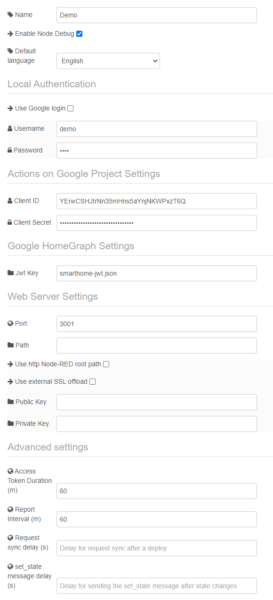
    

4. Deploy the flow.\
   

5. Check if your service is reachable. Open https://example.com:3001/check in your browser. You should see the
   "Google SmartHome test page". You don't need to fill in anything here, if you see the page, you are good to go.\
   

6. Also check if the page is reachable from the internet. Use a tool like https://reqbin.com to send a GET request to
   https://example.com:3001/check (using your domain name and port). It must answer with status 200 and the message
   "SUCCESS: Smart Home service is reachable!".\
   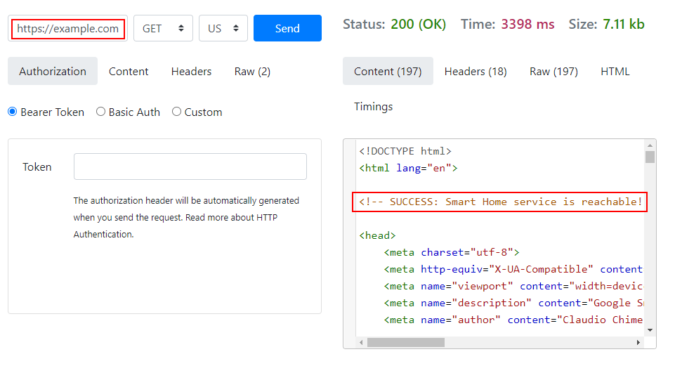

## Setup Account linking

Finally, we will link the Google Home App to the Node-RED service.

Note: Screenshots were taken on a german phone. If you can provide screenshots on an english phone, please open an issue
or a pull request.

1. Open the Google Home App on a device logged into the same account used to create the project in the Actions Console.

2. Click the '+' sign to add a device.\
   
   

3. Click *Set up device*.\
   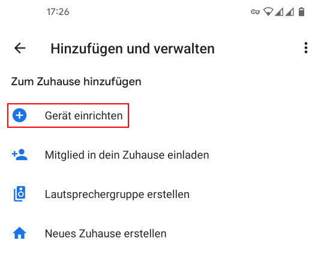

4. Click *Have something already set up*.\
   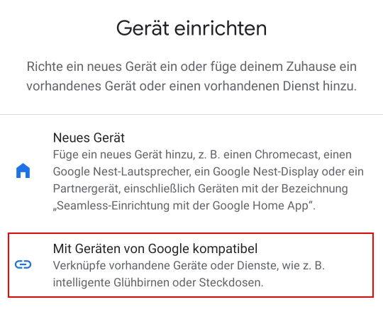

5. Find your app in the list of providers. It will be marked with `[test]`.\
   Note: Old projects will stay on this list, even after they are deleted. That's why I have several Demo projects.\
   

6. Log in to your service. Username and password are the ones you specified in the configuration node.\
   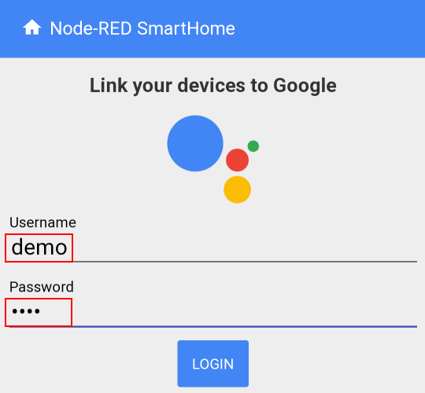

8. Say "Hey Google, sync my devices". Google should answer that your project was successfully synced.

9. Congratulations! Your project is successfully set up. You can now start adding devices.

## Integrating Google Sign-In (optional)

Your project was created using username/password based authentication. You can switch to authentication using
Google Sign-In if you want. This makes relinking your project in the app a little easier as you don't have to enter
your username and password again. For regular users it is not necessary though.

1. Navigate to the [Google Cloud Console API & Services page](https://console.cloud.google.com/apis/credentials)
2. Select your project from the drop-down on top of the page.
3. Select "OAuth consent screen" in the sidebar.
4. If you haven't configured the OAuth consent screen yet, you will be asked for the user type. Choose "External" and
   click "Create".
5. Specify the app name and an email address. Enter your domain "https://example.com" as "Application home page",
   "Application privacy policy link" and "Application terms of service link".
6. Add your domain "example.com" (without protocol and port) as authorized domain.
7. Enter your email address again as developer contact.
8. Click "Save and continue". Leave all other steps empty.
9. Select "Credentials" on the left sidebar.
10. Click "Create credentials" and choose OAuth client ID.
11. Choose "Web application" as application type.
12. In "Authorized JavaScript origin", add the URL of your app, e.g. https://example.com:3001.
13. As "Authorized redirect URIs", add the URL of your app followed by "/oauth", e.g. https://example.com:3001/oauth.
14. Click "Save".
15. Click the Download button next to your newly created entry and copy the Client ID. You will need it later.

